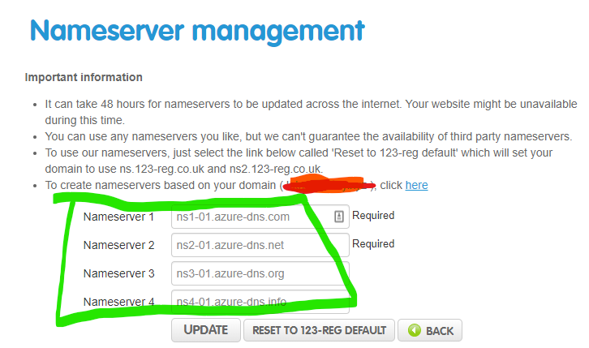

# Clusters of Domains - designing domains and DNS for AKS

While the [documentation on Azure DNS](https://docs.microsoft.com/en-us/azure/dns/) (at the time of writing in early 2020)) covers the essentials of what you need to know I personally found it somewhat dry in that it assumed that you knew what you wanted to do with Zones and records and mostly explained how to do create and configure each component piece without providing much context about when and where you need them and how you combine them into a  solution to meet requirements.

I was finding it initially difficult to synthesise and apply the pieces of information and there was a lack of something to place it all into a real-world solution-design context.

For example, how should I expose a suite of web applications or microservices and their APIs to the public internet whilst supporting a 'route to live' set of environments into which to deploy these artefacts so that they can be tested while they are under development.

In other words: 

> *How can I efficiently use domain names to support Development, Testing, Staging, and Production Environments?*

> *Should I use a separate domain name for each Environment?*

> *Do I need to have a separate Kubernetes cluster for each or can I combine custom domain names with one or more clusters in any combination?*

I'll share what I've found so far and hope to answer the above questions.

!!! note
    While my original design conundrum arose in how to use a custom domain name with one or more AKS clusters, this article will contain information relavant to using domain names with Azure Resources generally

## If at first you don't succeed - Play!

I knew I wanted to build a solution that would combine `cert-manager` and `external-dns` controllers in each Kubernetes cluster so that applications could be deployed without the Application Developers needing to manage either DNS records nor handling certificates or key pairs in deployment pipelines, thus also avoiding any risk of inadvertantly exposing secrets and certificates in source code repositories. 

My problem was that none of the documentation I could find brought all of these pieces together in a multi-environment solution. I could get pieces working in isolation but how to bring them all together?

!!! info
    **The `external-dns` project**

    This can be installed into a cluster and it watches deployments for any that require DNS records to be created or updated and it manages records in an associated Azure DNS Zone resource.

!!! info
    **The `cert-manager`project** 

    This is a native Kubernetes certificate management controller which can be used to issue certificates automatically. It ensures 

Initially I felt like I was going round in circles simply trying to get a 'multi-environment' design to occur to me by simply reading the documentation for AKS and for these other open-source components.

The break-through came when starting to implement something simple and trying to build towards a more complex solution (I simply didn't know where I was going before I set off - no compass, no map).

### Trying out `cert-manager`

Since I didn't have a custom domain name I could use I attempted to use the Azure-assigned fully qualified domain name (FQDN). Any AKS cluster into which a Service of type `LoadBalancer` has been deployed will have a Public IP resource deployed into the cluster-managed Resource Group. Any Azure Public IP (PIP) resource can optionally have a DNS name label applied which will then mean that this address will resolve to the IP address. So that seemed like the simplest way to test `cert-manager`.

!!! info
    The documentation states it best:

    *"You can specify a DNS domain name label for a public IP resource, which creates a mapping for domainnamelabel.location.cloudapp.azure.com to the public IP address in the Azure-managed DNS servers"*
    
    from: [IP address types and allocation methods in Azure > DNS hostname resolution](https://docs.microsoft.com/en-us/azure/virtual-network/virtual-network-ip-addresses-overview-arm)

So, in my case, given that adding a name label of `contosoapps` to my PIP the FQDN is therefore `contosoapps.westeurope.cloudapp.azure.com`.

Once this was working I was able to host multiple services, each with an Ingress based on the FQDN. So, for example, the `demo-nginx` app could be reached with the URL `demo-nqinx.contosoapps.westeurope.cloudapp.azure.com`.

| Application Name  |  FQDN |
|---|---|
|  demo-nginx |  demo-nqinx.contosoapps.westeurope.cloudapp.azure.com |
|  demo-aspdotnet | demo-aspdotnet.contosoapps.westeurope.cloudapp.azure.com  | 

But what if I also want to support multiple deployment environments?

| Application Name  |   Environment  |  URL |
|---|---|---|
|  demo-nginx | Development  |  *demo-nqinx.**dev**.contosoapps.westeurope.cloudapp.azure.com*\*  |
|  demo-nginx | Staging |  *demo-nqinx.**test**.contosoapps.westeurope.cloudapp.azure.com*\* |
|  demo-nginx | Production | demo-nqinx<span></span>.contosoapps.westeurope.cloudapp.azure.com |

Unfortunately those URLs marked with \* indicate that we cannot do this. Possible variations of the above that I considered were:

- demo-nqinx.**dev**...
- **dev**.demo-nqinx...
- **dev**-demo-nqinx...

I could not find this documented anywhere but it seems that name labels on Public IP Addresses only support a single label and so we cannot use FQDNS with anything other than 6-part names. In the first two examples above I'm trying to use 7-part names and in the third example I would need more than one name label on the IP address - one for each environment.

#### When in doubt - Puchase a Custom Domain Name!

So it was clear that I needed to purchase my own Custom Domain Name in order to fully explore and model a realistic scenario with multiple deployment environments. I registered a cheap domain I could use for testing for sake of this article I'll use the name `contosoapps.xyz`).

Once I have a domain I'll somehow need to use an Azure DNS Zone and DNS records in combination with Kubernetes Ingress Controller and Resources to expose a suite of web applications or microservices and their APIs to the public internet.

|  Purpose  |  Recordset Name  |  Record Type  | Alias Resource Type  |  Alias Resource Target  |
|---|---|---|---|---|
| Production | @ | NS |  |  |
| Development Environment Ingress | dev | A | Public IP Address | LoadBalancer Service Public IP |
| Staging Environment Ingress | staging | A | Public IP Address | LoadBalancer Service Public IP |

This model uses a single DNS Zone resource with an alias record for each Environment we wish to represent. This model works fine for a solution where we only want to use `cert-manager` is too simplistic if we also want to use `external-dns` to manage DNS records automatically without knowing all required names ahead of time.

### Trying out `external-dns`

The only [Microsoft documentation](https://docs.microsoft.com/en-us/azure/aks/http-application-routing) I could find covering `externals-dns` only applies to a cluster where the HTTP application routing add-on has been enabled and given that this add-on is not recommended for production use I wanted to avoiding this add-on.

!!! info
    **The HTTP application routing add-on** automatically creates a DNS Zone for you and creates two controllers inside the cluster (an Ingress controller and External-DNS controller) and I wanted to understand how to deploy and manage these components properly without it happening 'auto-magically'!

Eventually I was able to piece together the elements of a solution for using `external-dns` in AKS from [this page](https://github.com/JasonvanBrackel/kubernetes-external-dns-in-rancher) (albeit not using Rancher in my case).

Again this provided a working demonstration of `external-dns` on it's own but not in a multi-environment deployment context.

My problem is that with `external-dns` the DNS Zone resource represents the first *two parts* of my domain name. In this example, my Apex is `contosoapp.com` which has two parts, and `external-dns` controller would only manage *part three* by adding A-records such as `dev-app` and `staging-app`) but we'll be limited to three-part names.

## Hierarchy to the rescue!

This image gave me an idea!:


from: <https://docs.microsoft.com/en-us/azure/dns/dns-domain-delegation>

Why not have a hierachy of DNS zone resources?!

In a hierarchy of DNS Zone resources a 'parent' one delegates to one or more 'child' DNS Zones. This would enable us to implement my multi-environment model whereby each DNS Zone would be an environment (`dev.contosoapps.com`, `staging.contosoapps.com`) and the parent is the production environment (`contosoapps.com`)

I actually tried this out before I'd identified the area of the documentation that explains how to do it: [Delegate an Azure DNS subdomain](https://docs.microsoft.com/en-us/azure/dns/delegate-subdomain)

Once I'd got the idea of DNS zones referencing each other somehow, I went hunting for examples of what the Azure CLI commands for doing this might look like. Whilst searching for `az network dns zone` I came across a tiny snippet of code here: <https://jwendl.net/code-notes/azure/network/> which hinted at what I needed to do, so I went ahead and tried it.

My set of commands to acheive this in Azure CLI <br>
*this is in PowerShell rather then Bash incidentally*:

``` powershell
$dnsRgName='RG-DNS-Zones'
$domainName='contosoapps.xyz'
$dnsZoneId=$(az network dns zone create -g $dnsRgName -n $domainName --query id -o tsv)
 
$domainNameSub='dev.contosoapps.xyz'
$dnsZoneIdSub=$(az network dns zone create -g $dnsRgName -n $domainNameSub --query id -o tsv)
 
# list name servers for dev (subdomain) zone
$ns0=$(az network dns record-set ns show --resource-group $dnsRgName --zone-name $domainNameSub --name '@' --query "nsRecords[0]" -o tsv)
$ns1=$(az network dns record-set ns show --resource-group $dnsRgName --zone-name $domainNameSub --name '@' --query "nsRecords[1]" -o tsv)
$ns2=$(az network dns record-set ns show --resource-group $dnsRgName --zone-name $domainNameSub --name '@' --query "nsRecords[2]" -o tsv)
$ns3=$(az network dns record-set ns show --resource-group $dnsRgName --zone-name $domainNameSub --name '@' --query "nsRecords[3]" -o tsv)
 
# add subdomain NS records to apex zone
az network dns record-set ns create -g $dnsRgName -z $domainName -n 'dev'
az network dns record-set ns add-record -g $dnsRgName -z $domainName --record-set-name 'dev' --nsdname $ns0
az network dns record-set ns add-record -g $dnsRgName -z $domainName --record-set-name 'dev' --nsdname $ns1
az network dns record-set ns add-record -g $dnsRgName -z $domainName --record-set-name 'dev' --nsdname $ns2
az network dns record-set ns add-record -g $dnsRgName -z $domainName --record-set-name 'dev' --nsdname $ns3

```

!!! info 
    ** Delegating my custom domain **
    As described in the documentation [Tutorial: Host your domain in Azure DNS](https://docs.microsoft.com/en-us/azure/dns/dns-delegate-domain-azure-dns#delegate-the-domain): \
        *"In the registrar's DNS management page, edit the NS records and replace the NS records with the Azure DNS name servers."*

In my case this was with <https://123-reg.co.uk> and looks like this:



### A DNS Zone Per environment

With this solution in place we should now be free to allow an instance of `external-dns` manage each DNS Zone resource separately.

!!! note
    In Progress
    I've yet to actually try this last but - the plan is to flesh this article out step-by-step as I keep trying things!