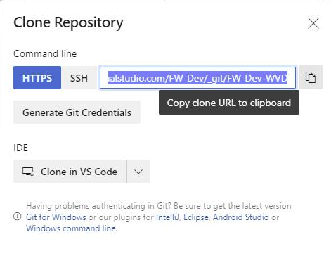
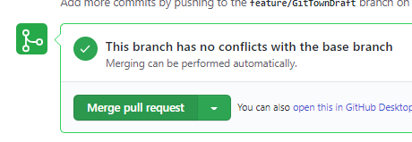

<span>Photo by <a href="https://unsplash.com/@simonmigaj?utm_source=unsplash&amp;utm_medium=referral&amp;utm_content=creditCopyText">Simon Migaj</a> on <a href="https://unsplash.com/s/photos/alone?utm_source=unsplash&amp;utm_medium=referral&amp;utm_content=creditCopyText">Unsplash</a></span>

I've been preparing some videos and learning materials for colleagues that work in Cloud but don't come from a Software Engineering background where disciplines such as version control and continuous integration are taken as granted.

## Preparing your machine

Install the most common extensions you might need. This is using [a tool called **Scoop** which I've talked about before](/misc/scoop).

Open Powershell and run this:

```powershell

Set-ExecutionPolicy RemoteSigned -scope CurrentUser
Invoke-Expression (New-Object System.Net.WebClient).DownloadString('https://get.scoop.sh')
scoop bucket add extras
scoop install sudo aria2
scoop install git posh-git
scoop install vscode windows-terminal
```

### Install extensions for VSCode

These are the extensions you'll probably need, you can add any VSCode tends to prompt you for any others you may need when you work with a new file type that it recognises is associated with an one or more suggested extensions

```powershell
code --install-extension ms-azure-devops.azure-pipelines
code --install-extension ms-vscode.azure-account
code --install-extension ms-vscode.azurecli
code --install-extension ms-vscode.powershell
code --install-extension msazurermtools.azurerm-vscode-tools
```

## Use Git for Version Control

### Set some default configuration

```powershell
git config --system core.longpaths true
```
And enable long paths (see: [Enable Long Paths in Windows](https://github.com/Azure/Enterprise-Scale/blob/main/docs/Deploy/getting-started.md#enabling-long-paths-on-windows))

Tell Git who you are (used as the author name/email when you issue the `git commit` command):

=== "Global Default"

    ```powershell
    # default details used for all repositories (if not over-ridden by a local config)
    git config --global user.name 'Your Name'
    git config --global user.email 'your.name@your.org'
    ```

=== "Current Repository"

    ```powershell
    # details used for the current repository (i.e over-riding any global config)
    git config --local user.name 'Your Name'
    git config --local user.email 'your.name@your.org'
    ```

???Info "What if I forget?"
    If you forget to set your email you get a pretty helpful error message like this:

    ```
    Author identity unknown

    *** Please tell me who you are.

    Run

      git config --global user.email "you@example.com"
      git config --global user.name "Your Name"

    to set your account's default identity.
    Omit --global to set the identity only in this repository.

    fatal: unable to auto-detect email address
    ```

### Start work on an existing Repository

Get the Git Clone URL from a repository you want to work on:



Open VSCode

then in VS Code Ctrl-Shift-P and then type 'git clone'

Change directory into the new directory that gets created after you have cloned the Repository

???Tip "Using different repositories with different credentials"
    If you commit to different repositories with different credentials then you will need to give Git some configuration info about yourself [as explained above](#set-some-default-configuration)
    ```powershell
    git config --local user.name 'Your Name'
    git config --local user.email 'your.name@your.org'
    ```

### Create a branch to work on

Use the branch command to [create the branch](https://docs.microsoft.com/en-us/azure/devops/repos/git/branches?view=azure-devops&tabs=command-line#create-a-branch) and checkout to swap to that branch.

```powershell
git branch feature/TryingSomething
git checkout feature/TryingSomething
```

Once you have edited or added some files you need to push you changes (but it's important to [update your branch with changes in the trunk](https://docs.microsoft.com/en-us/azure/devops/repos/git/pulling?view=azure-devops&tabs=command-line#update-your-branch-with-the-latest-changes-from-master) to avoid later merge conflicts when making a Pull Request]):

```powershell
git add .
git commit -m 'my commit message'
# merge the latest changes from main into the feature branch
git pull origin main
git push --set-upstream origin feature/TryingSomething
```

???Question "Why not just use `git push`?"
    i.e. what's the `--set-upstream` about?
    You'll get an error if you just use `git push` because [the remote branch doesn't yet exist](https://docs.microsoft.com/en-us/azure/devops/repos/git/pushing?view=azure-devops&tabs=command-line#share-your-code-with-push)):

    ```powershell
    fatal: The current branch feature/TryingSomething has no upstream branch.
    To push the current branch and set the remote as upstream, use

        git push --set-upstream origin feature/TryingSomething
    ```

### Create and merge a Pull Request

Open up your Repository in Azure DevOps or GitHub and create a pull request:


If all goes well your Pull Request will get approved and merged and you no longer need your local branch for this feature (the remote branch will have been deleted and you need to clean up your working directory).



### Deleting your branch

You no longer need the Feature Branch as it's been deleted on the remote

```powershell
git checkout main
## update the local copy of the main branch
git pull
# delete the local copy
git branch -D feature/TryingSomething
```
### Managing changes and conflicts

Finding that someone else has modified the same file in a previous (or even concurrent) commit or in another branch that you're now merging your code with can be a truly terror-inducing prospect. I recently discovered how to use Visual Studio Code as the user interface for seeing what the conflict is and deciding whether to take **their** changes, keep **my** changes or take some combination of the two - all in the same code editor rather than learning lots of commands or jumping to another tool.

I highly recommend reading this post - [How to use VS Code as your Git editor, difftool, and mergetool](https://roboleary.net/vscode/2020/09/15/vscode-git.html). I couldn't have explained it better myself!


## Going even faster with `git town`

Clearly this is a lot of commands to have to exectue each time you need to do some Feature work so there's a great tool that makes this much easier!

A quicker way to run through the steps starting from [create a branch](#create-a-branch-to-work-on) above is to use a tool called [`Git Town`](https://www.git-town.com/)

```powershell
# installs the tool
scoop install git-town

# makes a feature branch to work on and drops you into it!
git town hack feature/TrySomethingElse
```

Do some work...

```powershell
Add-Content newfile.txt ''
```

Add and commit the changes:

```powershell
git add .
git commit -m 'Your commit message'
```

This command then does all the hard work of getting your `main` up to date and merging your local branch and then pushing your work up to the remote (all in one line!)

```powershell
git town sync
```

[Create and merge a Pull Request](create-and-merge-a-pull-request) as above

```powershell
# cleans up and deletes redundant local branches
git town prune-branches
# get everything up to date
git town sync
```

Here's the [whole process](https://asciinema.org/a/xxY6bfxValIgJZzQ2kkZlBZZw) in action!:
<script id="asciicast-xxY6bfxValIgJZzQ2kkZlBZZw" src="https://asciinema.org/a/xxY6bfxValIgJZzQ2kkZlBZZw.js" async></script>

## Creating and completing Pull Requests in Azure Repos from command-line

If you're using Azure Repos (Azure DevOps) rather than GitHub then here's a neat way to [create a Pull Request](https://docs.microsoft.com/en-us/cli/azure/repos?view=azure-cli-latest#az_repos_create) (using the [Azure CLI DevOps extension](https://docs.microsoft.com/en-gb/azure/devops/cli/?view=azure-devops)) from the current feature branch without leaving the command prompt

Create a Pull request:

`$prId=(az repos pr create --query 'pullRequestId' -o tsv)`

Open in browser (NB: we can also use the --open flag with the `az repos create` command above):

`az repos pr show --id  $prId --open`

Get details:

`az repos pr show --id  $prId --query '{Id:pullRequestId,Status:status,Title:title}' -o table`

Set to Approved:

`az repos pr set-vote --vote approve --id  $prId`

Complete the pull request:

`az repos pr update --status completed --id  $prId --squash true`

## Another way to clean up redundant local branches

I use [this great tool from Maks Nemisj](https://github.com/nemisj/git-removed-branches) to remove local branches which are no longer present in my Git remote (usually because closing my Pull Request has also caused the remote branch to be deleted).


```
git removed-branches --prune --force
```

## Some common questions

I hope to come back and answer these questions in due course:

### Why are you making me type commands. Can't I just use the GUI?

### What if I already made a Pull Request and want to make some more changes?

### What about creating a new Repository from scratch?

### What if I already have some files locally that I need to put into an existing Repository?

### How does Git get my remote (i.e. GitHub / Azure DevOps) credentials?

Short answer - it gets it from Windows.

### What if I'm behind a corporate proxy

### What about deployment pipelines?

I'm hoping to write about those too in due course!
