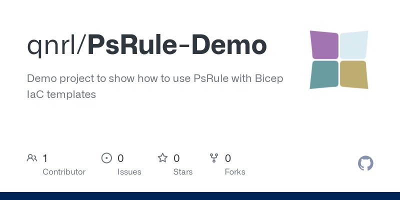
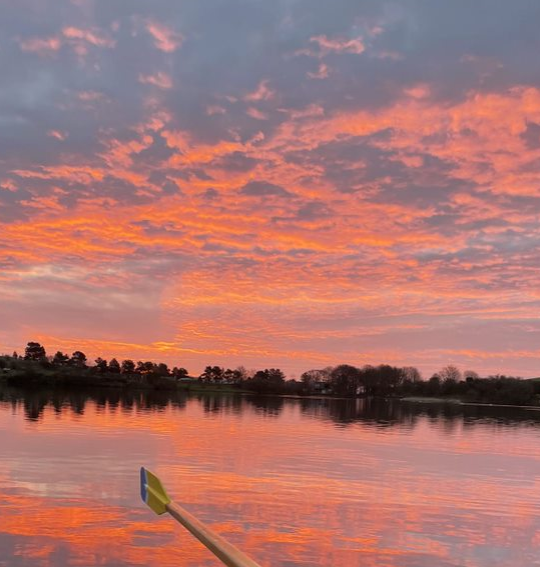

## Using `PsRule` to analyse Bicep templates ##

Last week I made this. It's a 'simplest possible' sample project to show how to [use PsRule for Azure with a Bicep template](https://azure.github.io/PSRule.Rules.Azure/using-bicep/).

You can find the repository on the Quorum GitHub organization here: [https://github.com/qnrl/PsRule-Demo](https://github.com/qnrl/PsRule-Demo)

A while ago a colleague recommended a tool called [PsRule](https://microsoft.github.io/PSRule/v2/). I read through some of the documentation and it looked interesting but I didn't have a use case for it at the time, and it also wasn't immediately obvious how to use it.

I felt that what was lacking was a hello-world example that would demonstrate the value of the tool and show how to use it. Then I found [a blog post that explained how to use PsRule for analysing a Bicep template](https://techcommunity.microsoft.com/t5/itops-talk-blog/psrule-introduction-to-infrastructure-as-code-iac-testing/ba-p/3580746) and I thought that was a good example to start with, so I went ahead and made myself a project to try it out using the sample Bicep template from the blog post.

Once I'd done that it became clear that I could use this project to show other people in my company so I pushed it up to the Quorum GitHub organization so that I could do an internal 'Communities of Practice (CoP)' talk using this as a demo. I soon decided that I may as well make it a public repository so that everyone could benefit from seeing it, and so I added a few more tweaks (such as making it compatible with GitHub Codespaces) that would make it easy for anyone to come along and try out the tool.

Try it out [here!](https://github.com/qnrl/PsRule-Demo)

