---
title: Dysart Code Club
disqus: ''
hero: Dysart Code Club Links and Info
description: Resources for participants at Dysart Code Club
authors:
    - Rohan Cragg
date: 2022-05-05
page_path: learning/
og_image: media/dysps.jpg
og_image_type: image/jpg
---

## About Dysart Code Club

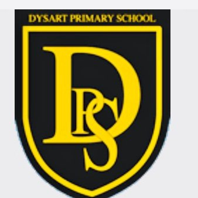

I have been volunteering at my children's school ([Dysart Primary School](https://www.fife.gov.uk/facilities/primary-school/dysart-primary-school)) running a code club for P4 to P7.

## Code Club Resources and Links

Here are some links to the things we've been doing do far in the club (click on the links in the text below).

We started off coding some simple block-based projects in Scratch using the [Code Club World](https://codeclubworld.org/) site.

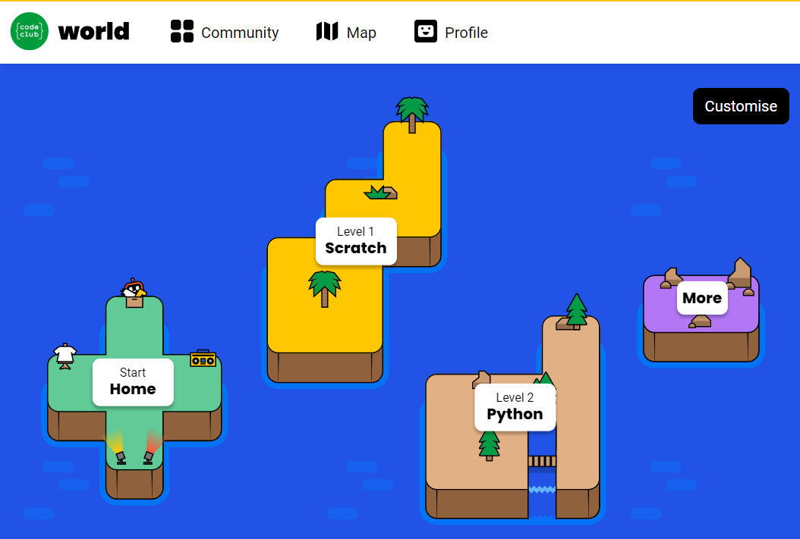

Then we had a couple of sessions using [Microsoft MakeCode Arcade](https://arcade.makecode.com/) to play with simple block-based games and animations (and how to make our own).

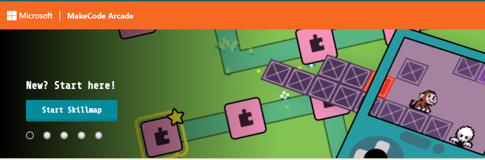

It's not necessary to have an account to play and code on the MakeCode Arcade site, but if your child would like to save their work and come back to it another time then this link explains [how to create a Microsoft Account to log in to MakeCode Arcade](https://arcade.makecode.com/identity/sign-in).

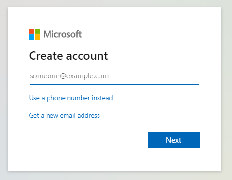

I purchased some 'game pads' to use in Code Club. There are little pieces of hardware (devices) onto which we can use the MakeCode Arcade site to download games onto the devices. Here is [a list of devices you can buy to load games onto](https://arcade.makecode.com/hardware), and this is [a great site where you can buy most of these devices](https://www.mouser.co.uk/ProjectManager/ProjectDetail.aspx?State=EDIT&ProjectGUID=b8fe70a4-b7be-4fd5-ab6e-f53993576d97).

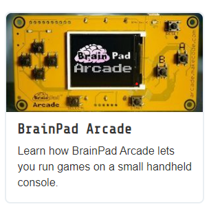 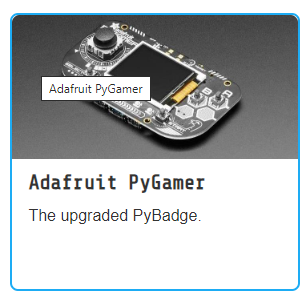 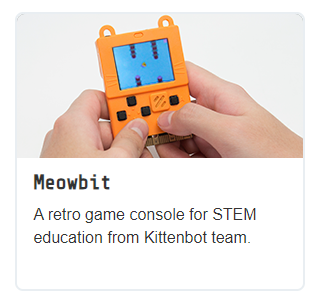

One of the game pad manufacturers (Tinkergen) has [their own set of tutorials and lessons](https://make2learn.tinkergen.com/course/?sku=604182001) with additional ideas and projects that can be loaded into MakeCode Arcade.

### Bookmarks for games we've looked at so far

- [Grow a Dragonfly](https://projects.raspberrypi.org/en/projects/grow-a-dragonfly)

Here's my remix!
<iframe src="https://scratch.mit.edu/projects/702661412/embed" allowtransparency="true" width="485" height="402" frameborder="0" scrolling="no" allowfullscreen></iframe>

- As featured on the Hanselminutes Podcast [How kids learn how to Code with MakeCode's Kiki Prottsman](https://hanselminutes.com/835/how-kids-learn-how-to-code-with-makecodes-kiki-prottsman)
 I found a nice simple animation game on [Kiki's blog](https://medium.com/kikis-corner/bunny-glow-up-f18915bc98c9). We had fun customising the sprites and making funny backgrounds.

  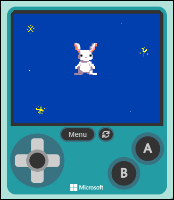

- [Swinging Piñata](https://projects.raspberrypi.org/en/projects/party-pinata/0)

  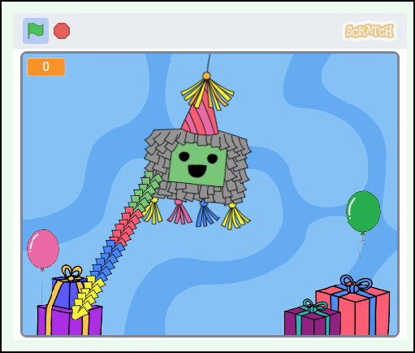

- [Falling Duck](https://arcade.makecode.com/84487-43288-49339-22583)

  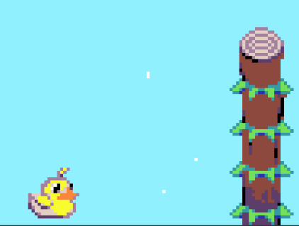

- [Water-drop and Hamburger](https://makecode.com/_VtU9tW53VPuy)

  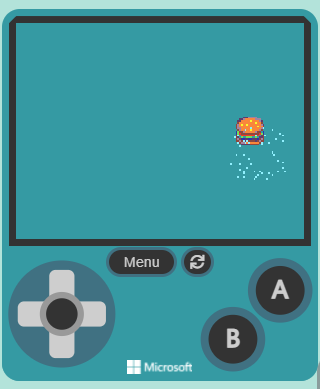

- [Trampoline](https://makecode.com/_MDU0zaFCWFUY)

  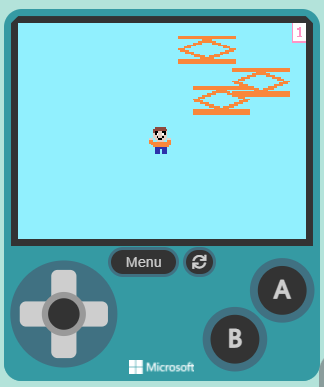

- [Interstellar](https://makecode.com/_Jc9EgX0gMDoi)

  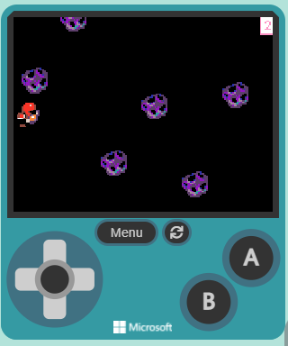

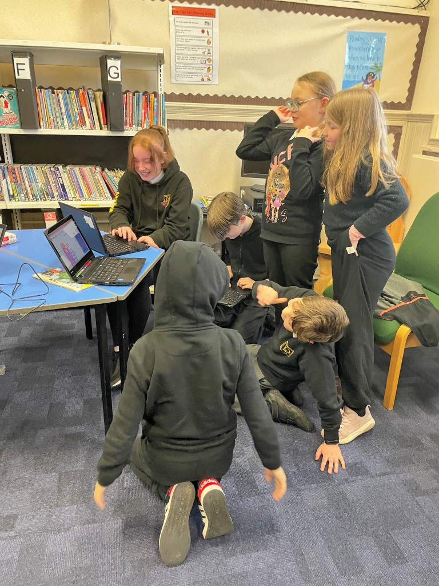

## Coming up...

### More Fun with MakeCode Arcade

[ZooKeeper's Adventure Skillmap](https://arcade.makecode.com/--skillmap#zoo)

### (RaspberryPi) Code Club's 10th Birthday

[​Code Club](https://projects.raspberrypi.org/en/codeclub), a global network of free coding clubs
for 9- to 13-year-olds run by the RaspberryPi Foundation, is celebrating its 10th birthday this year. To celebrate [we're going to create a swinging piñata](https://projects.raspberrypi.org/en/projects/party-pinata/0) that releases treats when it is hit, and eventually breaks to reveal a birthday message!

Did you know that there are Code Clubs on six out of seven continents around the world? That’s a lot of coders making things with code! Do you think any other clubs will be doing this project right now?

### Making Beats with SonicPi

[Sonic Pi](https://sonic-pi.net/) is a new kind of musical instrument, designed for creating sounds with code. We'll follow some of these [lessons on Code Club site](https://projects.raspberrypi.org/en/codeclub/sonic-pi)

## Possible future project ideas

Using the free [Blender](https://www.blender.org/) software to [make rich 3D animations](https://projects.raspberrypi.org/en/projects/blender-animate-snow-scene)

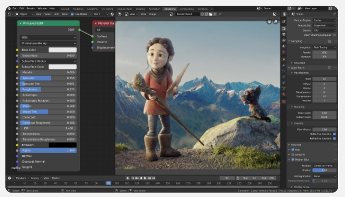

[Coding games on the web with Phaser](https://phaser.io/learn)

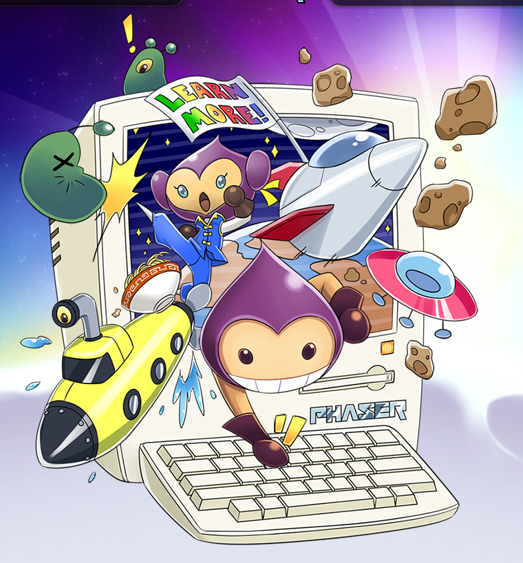

[3D game development with Unity](https://learn.unity.com/course/getting-started-with-unity?signup=true)

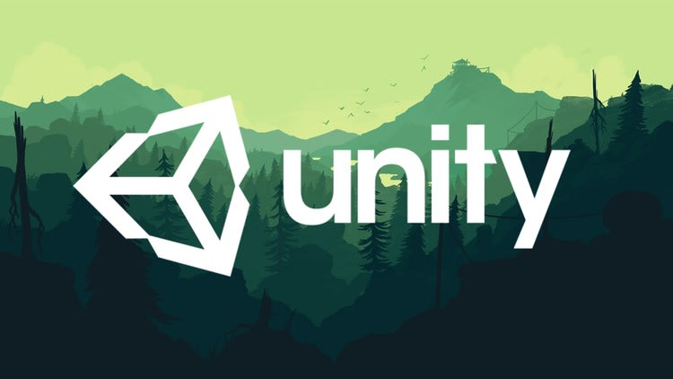
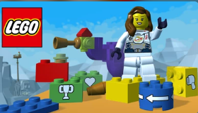