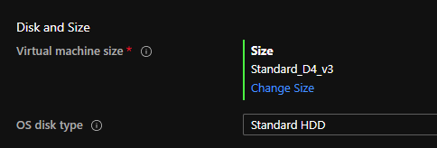

This page describes how I configure myself a Dev VM in Microsoft Azure

## How I build my workstations in the sky

### Choosing a Virtual Machine Size in Azure

The critical first step in configuring an effective Development environment on the Azure Cloud platform is to get a machine with an appropriate level of performance without incurring too much cost.

This page explains sizes for [Linux virtual machines in Azure](https://docs.microsoft.com/en-us/azure/virtual-machines/linux/sizes) and [for Windows](https://docs.microsoft.com/en-us/azure/virtual-machines/windows/sizes?toc=/azure/virtual-machines/windows/toc.json&bc=/azure/virtual-machines/windows/breadcrumb/toc.json).

### Do you I need nested virtualisation?

If I want to use WSL [Windows Subsystem for Linux](https://docs.microsoft.com/en-gb/windows/wsl/) then (as I discovered from [this Q&A](https://docs.microsoft.com/en-us/answers/questions/38156/wsl2-on-azure-windows-10-vm.html)) the Virtual Machine size needs to be sufficient to allow nested virtualisation (which is enabled [as described in this article](https://docs.microsoft.com/en-us/azure/virtual-machines/windows/nested-virtualization)). In other words I need to [pick an ACU](https://docs.microsoft.com/en-us/azure/virtual-machines/acu) (Azure Compute Unit) where the processors (CPUs) in a hyper-threaded configuration and therefore capable of running nested virtualization. at the time of writing this includes [D_v3 or Ds_v3](https://docs.microsoft.com/en-us/azure/virtual-machines/dv3-dsv3-series), [Dv4 or Dsv4](https://docs.microsoft.com/en-us/azure/virtual-machines/dv4-dsv4-series) and so on). For a Windows 10 Pro 2004 VM in West Europe I had to pick D4_v3



### Linux VM or Linux on a Windows VM?

As I mentioned on my [Bash shell on Windows](git-bash.md) article in April I'm still primarily a Windows user but have been gradually using Linux tools and shells and even SSH-ing onto Linux servers for work. As such I've recently decided to spend more time doing my work in a WSL environment on Windows (which allows you to use Linux distros directly from your Windows 10 machine). Now that the next interation of WSL has been released (WSL2) it seemed like a great time to take the next leap.

### Tips for a great Dev environment with WSL2

??? Info "What is WSL2?"
    WSL 2 uses an entirely new architecture that uses a *real Linux kernel* on Windows!. WSL 2 uses the latest and greatest in virtualization technology to run a Linux kernel inside of a lightweight utility virtual machine (VM). WSL 2 is a new version of the architecture that powers the Windows Subsystem for Linux to run ELF64 Linux binaries on Windows. Its primary goals are to increase file system performance, as well as adding full system call compatibility. This new architecture changes how these Linux binaries interact with Windows and your computer’s hardware, but still provides the same user experience as in WSL 1 (the current widely available version). Individual Linux distros can be run either as a WSL 1 distro, or as a WSL 2 distro, can be upgraded or downgraded at any time, and you can run WSL 1 and WSL 2 distros side by side.

#### Get WSL2

Before installing any Linux distributions on Windows, you must enable the "Windows Subsystem for Linux" optional feature, and to update to WSL 2, you must meet the following criteria:

The steps are slightly different when running Windows 10 or Windows Server. If I pick a Windows 10 rather than a Windows Server VM the [commands for installing Hyper-V on Windows 10](https://docs.microsoft.com/en-us/virtualization/hyper-v-on-windows/quick-start/enable-hyper-v) are slightly different:

```powershell
# Windows 10 (version 2004 and later)
Enable-WindowsOptionalFeature -Online -FeatureName Microsoft-Hyper-V -All

# Windows Server 2019 (version 1709 and later)
Install-WindowsFeature -Name Hyper-V -ComputerName <computer_name> -IncludeManagementTools
```
- [Install WSL2 on Windows Server](https://docs.microsoft.com/en-gb/windows/wsl/install-on-server)
- [Install WSL2 on Windows 10](https://docs.microsoft.com/en-gb/windows/wsl/install-win10)

#### Use a single `Git Credential Manager` on Windows

Even thogh you may not be aware of it, when you use Git on Windows Git a Git Credential Manager stores authentication tokens securely in the Windows Credential Manager. After the first time, you can use git to talk to your hosting provider you then no longer need to keep re-authenticating. It will just access the token in the Windows Credential Manager.

To set up Git Credential Manager for use with a WSL distribution, open your distribution and enter this command (as described in [this article](https://docs.microsoft.com/en-us/windows/wsl/tutorials/wsl-git#git-credential-manager-setup)):

```bash
git config --global credential.helper "/mnt/c/Program\ Files/Git/mingw64/libexec/git-core/git-credential-manager.exe"
```

However, because I use Scoop to install most things, I found that the correct path is as follows:

```bash
git config --global credential.helper "/mnt/c/Users/rohanc/scoop/apps/git/current/mingw64/libexec/git-core/git-credential-manager.exe"
```

#### Use Visual Studio Code inside of WSL

I was amazed to find that I can open VSCode from a directory in the WSL shell (e.g. perhaps I just cloned a code repo and navigated into a folder). I can simply hit `code .` and we're away:

More here: <https://docs.microsoft.com/en-us/windows/wsl/tutorials/wsl-vscode#open-a-wsl-project-in-visual-studio-code>

When I open a terminal window in VSCode I'm immediately dropped into the ZSH shell I've got set up in my WSL distro (Ubuntu 18.04 LTS in my case).

### More tips for a great Dev Environment

Much inspiration for this post (using WSL2 and setting up ZSH and [OhMyZsh](https://github.com/ohmyzsh/ohmyzsh)) was gleaned from this excellent guide: [WSL2: Making Windows 10 the perfect dev machine!](https://partlycloudy.blog/2020/06/05/wsl2-making-windows-10-the-perfect-dev-machine/)

See also: [How to Use Zsh (or Another Shell) in Windows 10](https://www.howtogeek.com/258518/how-to-use-zsh-or-another-shell-in-windows-10/)
