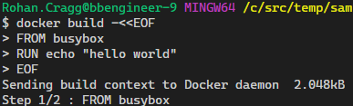

# Using a Bash shell on Windows

I'm primarily a **Windows 10** user and I primarily use **PowerShell** as my day-to-day command shell (*[Powershell Core](https://github.com/powershell/powershell) 6.2.4 at time of writing*). When I'm reading or editing code or scripts I primarily use [**Visual Studio Code,**](https://code.visualstudio.com/) so I often use the integrated terminal there, and so my daily default is PowerShell Core there too. For work unrelated to code or for more serious admin work I also tend to have a [Windows Terminal](https://github.com/microsoft/terminal) open all day too.

:fa-heart:  :fa-heart:  :fa-heart:

Even though I have Git for Windows (i.e. [`scoop install git`](scoop.md)) and therefore Git Bash is ready and waiting as the most obvious tool for using Git, I **don't** generally use Git Bash. I much prefer doing all my Git version control work in PowerShell with the very capable assistance of the [`posh-git` Module](https://github.com/dahlbyk/posh-git).


So make no mistake, I'm not advocating using Git Bash all the time. This article is about how to get a smooth experience for those times when I do find myself working in the Git Bash shell, as I'll explain below.

I often find code snippets for automating things in my world (mostly Azure Cloud admin and development) tend to assume that I'm using a Linux shell of some sort and so the commands and scripts are in Bash.

Specifically, I do lots of things with tools such as [Azure CLI](https://docs.microsoft.com/en-us/cli/azure/?view=azure-cli-latest) and Kubectl (the CLI for Kubernetes) and the examples for these technologies often default to giving examples or scripts in Bash shell syntax. While these are usually pretty simple to transpose into something that could execute in PowerShell (see below) it's still annoying not to be able to copy-and-paste and execute the commands there and then; or add them to a script file for future use without first translating them to PowerShell.

## Boring option - Transposing between Bash and PowerShell

Bash and PowerShell have some aspects of syntax in common (e.g. when referencing a variable like this: `$myVariable`)

But there are some other things that differ (e.g. when assigning a variable like this):

``` powershell tab="PowerShell"
$myVariable='some text'
```

``` bash tab="Bash"
myVariable='some text'
```

... or when setting an environment variable like this:

``` PowerShell tab="PowerShell"
SET MY_ENV='some text'
```

``` bash tab="Bash"
export MY_ENV='some text'
```

??? info "Shell Trivia"
    SH is Bourne Shell and so Bash is Born-again Bourne Shell

## Cool option - Git Bash

I already had a nice auto-complete experience with `posh-git` in PowerShell so I want the experience to be just as good in Git Bash, and the auto-complete for Kubectl is one of my reasons for using Git Bash at all so configuring auto-complete is my first step!

### Coolness pt.1 - Configuring Auto-Complete 

First off, I need a `.bashrc` file, so I needed to make one as it didn't exist on my machine:

```bash
touch ~/.bashrc
```

??? info "What is `.bashrc`?"
    According to <https://www.maketecheasier.com/what-is-bashrc/>
    
    *In order to load your preferences, bash runs the contents of the bashrc file at each launch. This shell script is found in each user’s home directory. It’s used to save and load your terminal preferences and environmental variables.*

#### Git

Here's how to get auto-complete for :fa-git: commands in Git Bash on Windows.

```bash
mkdir ~/bash_completion.d   
curl -o ~/bash_completion.d/git https://raw.githubusercontent.com/git/git/master/contrib/completion/git-completion.bash
echo "source ~/bash_completion.d/git" >> ~/.bashrc
```

If using PowerShell (as I often do) then the [`posh-git`](https://github.com/dahlbyk/posh-git) Module is a great option too.
```powershell
scoop install posh-git
```

??? info "What is Git?"
    :fa-git: is a free and open source distributed version control system designed to handle everything from small to very large projects with speed and efficiency.
    
    A version-control system is a tool for tracking changes in source code during software development. It is designed for coordinating work among a group of programmers, but it can be used to track changes in any set of files.

#### kubectl CLI

The kubectl completion script for Bash can be generated with the command `kubectl completion bash` [more details here](https://kubernetes.io/docs/tasks/tools/install-kubectl/#optional-kubectl-configurations)

Here's how to get auto-complete for `kubectl` commands in Git Bash on Windows.

```bash
kubectl completion bash > ~/bash_completion.d/kubectl
echo "source ~/bash_completion.d/kubectl" >> ~/.bashrc
```

??? info "What is Kubectl?"
    [Kubectl](https://kubernetes.io/docs/reference/kubectl/overview/) is a command line tool for controlling Kubernetes clusters.

    For Azure Kubernetes Service (AKS) users, the [Kubectl CLI tool can be installed using the Azure CLI](https://docs.microsoft.com/en-us/cli/azure/aks?view=azure-cli-latest#az-aks-install-cli) using the command `az aks install-cli`

#### Docker

There also Bash completion files [for Docker client](https://github.com/docker/cli/tree/master/contrib/completion/bash), [for Docker CLI](https://docs.docker.com/machine/completion/) and [for Docker Compose](https://docs.docker.com/compose/completion/)

```bash
# Docker CLI:
curl -o ~/bash_completion.d/docker https://raw.githubusercontent.com/docker/cli/master/contrib/completion/bash/docker
echo "source ~/bash_completion.d/docker" >> ~/.bashrc

# Docker Machine
curl -o ~/bash_completion.d/docker-machine https://raw.githubusercontent.com/docker/machine/v0.16.0/contrib/completion/bash/docker-machine.bash
echo "source ~/bash_completion.d/docker-machine" >> ~/.bashrc

# Docker Compose:
curl -o ~/bash_completion.d/docker-compose https://raw.githubusercontent.com/docker/compose/1.25.3/contrib/completion/bash/docker-compose
echo "source ~/bash_completion.d/docker-compose" >> ~/.bashrc
```

### Coolness pt.2 - Using Git Bash as an Integrated Shell in VSCode

Git Bash is a 'Linux-like' shell experience without going 'all the way' and dropping into the Windows Subsystem of Linx (WSL) Bash shell.

Whilst there are times when I'll use WSL too, there are times when I want to be working 'in Windows' but using a more Bash-like experience. This is where Git Bash come to the rescue.

??? tip "Getting Git Bash"
    Git Bash is installed for you when you install Git for Windows, so if you're already using Git then you've kinda got this for free anyway. To get it use [Scoop](scoop.md) by running this command: `[scoop](scoop.md) install git`

> *In Visual Studio Code, you can open an integrated terminal, initially starting at the root of your workspace. This can be convenient as you don't have to switch windows or alter the state of an existing terminal to perform a quick command-line task.*
>
> from: [Integrated Terminal](https://code.visualstudio.com/docs/editor/integrated-terminal)

As [this StackOverflow answer](https://stackoverflow.com/a/40489824/5351) explains you can change the default integrated terminal by updating the setting `terminal.integrated.shell.windows`.

For now, I set mine to `C:/Program Files/Git/bin/bash.exe`.

!!! note
    I probably won't keep this as a permanent change to my default integrated terminal, I've also been using the [Shell Launcher extension](https://marketplace.visualstudio.com/items?itemName=Tyriar.shell-launcher) to open up the various shells that I tend to use in VSCode)

Now I can use `Ctrl-Shift-'` ( i.e. the default Key Binding to `workbennch.action.terminal.new` ) to open a new integrated terminal which will be running Git Bash and to which I can send commands from text editor windows, like this:


I also added a Terminal [Key Binding](https://code.visualstudio.com/docs/getstarted/keybindings) for the F8 key to be bound to  `workbench.action.terminal.runSelectedText` so that whilst editing a shell (`.sh`) file in the editor, I can easily send the selected commands to my active terminal in VSCode.

## -> TLDR; so what?!

I already mentioned that I wouldn't normally use this as my preferred shell for Git. I'll only use it for Git when I happen to be in the Git Bash shell for some other reason; so what are those reasons?.

I mentioned that I find this useful for **Kubernetes** admin work (i.e. **kubectl**). But it's also more natural than PowerShell for working with the **Docker** client.

For example, if I want to copy and paste code samples for working with Docker such as the ones in the [Dockerfile Best Practices page](https://docs.docker.com/develop/develop-images/dockerfile_best-practices/). I'm not aware of a way to transpose the following command stright into PowerShell terminal:

``` bash
docker build -<<EOF
FROM busybox
RUN echo "hello world"
EOF
```

...but I can do it in Git Bash no problem at all!:


