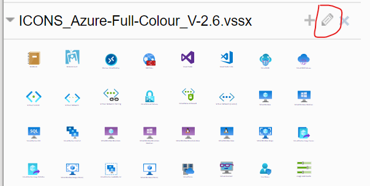
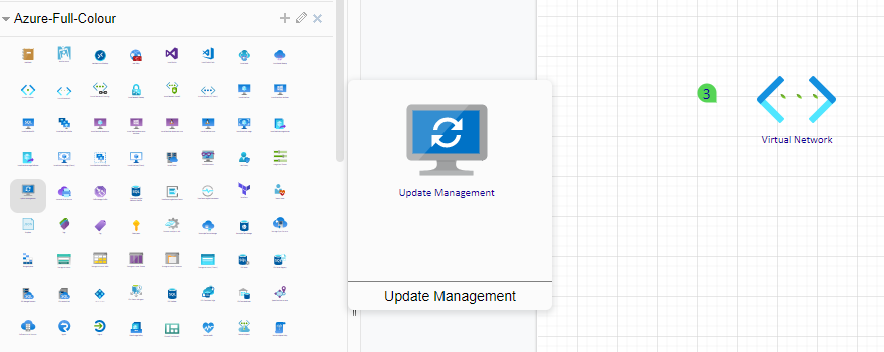
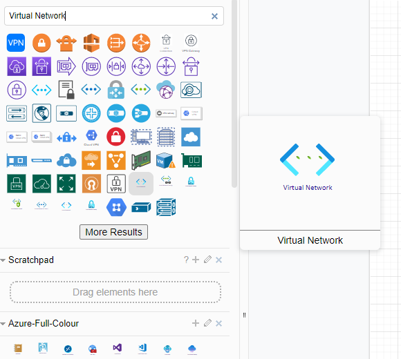

When I need to draw technical diagrams for projects we're working on using Azure I need shapes that represent the services we're using and it's not too difficult to find sets of shapes that can be used in Microsoft Visio. But I don't have a licence for Visio and so instead I tend to use the popular drawing tool [Draw.io](https://app.diagrams.net/)

> Incidentally, Draw.io is now called Diagrams.net

After a quick search one I found was a Visio stencil for Azure architecture design and documentation. 

## Importing Shapes from a Visio stencil

Here's how 

Download the zip file from Dave Summers' [Github Repository](https://github.com/David-Summers/Azure-Design):

Then Import the `.vssx` file:

Then you'll want to edit the name of the shapes folder like this:

Draw-io will download a `.drawio` file which you can ignore if you wish:

Here's how the shapes look when you hover over them:

Here's how the shapes will show up in search results when you search for them:

## Other sources of Shapes

There are some other shapes out there too such as the [Microsoft Integration Stencils Pack for Visio](https://gallery.technet.microsoft.com/Collection-of-Integration-e6a3f4d0) by [Sandro Pereira](https://www.linkedin.com/in/sandropereira/) (@twitter:sandro_asp)
