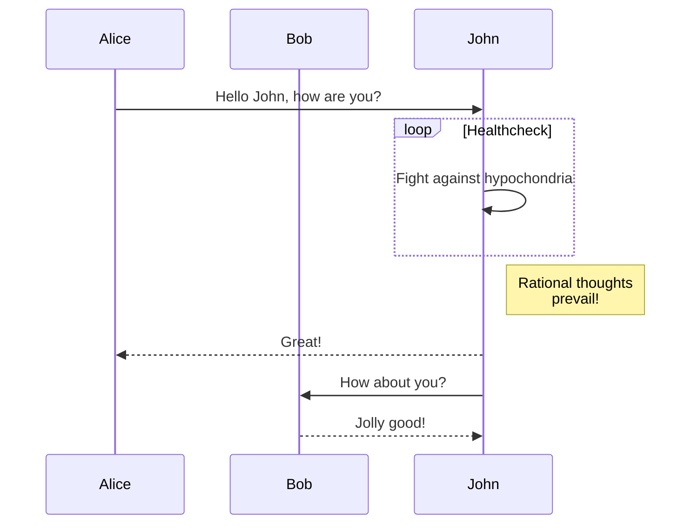

---
disqus:
---

## Arithmatex

$$
E(\mathbf{v}, \mathbf{h}) = -\sum_{i,j}w_{ij}v_i h_j - \sum_i b_i v_i - \sum_j c_j h_j
$$

\[3 < 4\]

\begin{align}
    p(v_i=1|\mathbf{h}) & = \sigma\left(\sum_j w_{ij}h_j + b_i\right) \\
    p(h_j=1|\mathbf{v}) & = \sigma\left(\sum_i w_{ij}v_i + c_j\right)
\end{align}

## Carets
Testing ^^carets^^

## Critic

Don't go around saying{-- to people that--} the world owes you a living. The world owes you nothing. It was here first. {~~One~>Only one~~} thing is impossible for God: To find {++any++} sense in any copyright law on the planet. {==Truth is stranger than fiction==}{>>strange but true<<}, but it is because Fiction is obliged to stick to possibilities; Truth isn’t.

Don't act so surprised, Your {~~Queen~>Highness~~}{>>@gsw sounds better<<}. You weren't on any mercy mission this time.

## Details

???+ note "Open styled details"

    ??? danger "Nested details!"
        And more content again.

??? success
   Content.

??? warning classes
   Content.

## Emoji

:smile: :heart: :thumbsup:

## EscapeAll
\W\e\ \c\a\n\ \e\s\c\a\p\e
\e\v\e\r\y\t\h\i\n\g\!\ \
\❤\😄

## Highlight

`#!php-inline $a = array("foo" => 0, "bar" => 1);`

## InlineHilite 

Here is some code: `#!py3 import pymdownx; pymdownx.__version__`.

The mock shebang will be treated like text here: ` #!js var test = 0; `.

### inline math
`#!math p(x|y) = \frac{p(y|x)p(x)}{p(y)}`

## Keys

++ctrl+alt+delete++

## auto linking

- Just paste links directly in the document like this: https://google.com.
- Or even an email address: fake.email@email.com.

### mentions

GitHub: @github:facelessuser

GitLab: @gitlab:facelessuser

BitBucket: @bitbucket:facelessuser

Twitter: @twitter:rohancragg

### repo mentions

@facelessuser/pymdown-extensions

@gitlab:pycqa/flake8

### Issues and PRs

Issue #1

Issue backrefs#1

Issue Python-Markdown/markdown#1

Issue gitlab:pycqa/flake8#385

Pull request !13

Pull request backrefs!4

Pull request Python-Markdown/markdown!598

Pull request gitlab:pycqa/flake8!213

### commits

181c06d1f11fa29961b334e90606ed1f1ec7a7cc

backrefs@cb4ecc5e7d8f7cdff0bb4482174f2ff0dcc35c61

Python-Markdown/markdown@de5c696f94e8dde242c29d4be50b7bbf3c17fedb

gitlab:pycqa/flake8@8acf55e0f85233c51c291816d73d828cc62d30d1

### compare

e2ed7e0b3973f3f9eb7a26b8ef7ae514eebfe0d2...90b6fb8711e75732f987982cc024e9bb0111beac

backrefs@88c6238a1c2cf71a96eb9abb4b0213f79d6ca81f...cb4ecc5e7d8f7cdff0bb4482174f2ff0dcc35c61

Python-Markdown/markdown@007bd2aa4c184b28f710d041a0abe78bffc0ec2e...de5c696f94e8dde242c29d4be50b7bbf3c17fedb

gitlab:pycqa/flake8@1ecf97005a024391fb07ad8941f4d25c4e0aae6e...9bea7576ac33a8e4f72f87ffa81dfa10256fca6e

### link shorteners - external

- https://github.com/facelessuser
- https://github.com/facelessuser/pymdown-extensions
- https://gitlab.com/pycqa/flake8/issues/385
- https://bitbucket.org/mrabarnett/mrab-regex/issues/260/extremely-slow-matching-using-ignorecase

### internal

- https://github.com/facelessuser/pymdown-extensions/issues/1
- https://github.com/facelessuser/pymdown-extensions/pull/13
- https://github.com/facelessuser/pymdown-extensions/commit/3f6b07a8eeaa9d606115758d90f55fec565d4e2a
- https://github.com/facelessuser/pymdown-extensions/compare/e2ed7e0b3973f3f9eb7a26b8ef7ae514eebfe0d2...90b6fb8711e75732f987982cc024e9bb0111beac
- https://github.com/facelessuser/Rummage/commit/181c06d1f11fa29961b334e90606ed1f1ec7a7cc

## Mark

==mark me==

==smart==mark==

## Progress Bars

[=0% "0%"]
[=5% "5%"]
[=25% "25%"]
[=45% "45%"]
[=65% "65%"]
[=85% "85%"]
[=100% "100%"]

[=85% "85%"]{: .candystripe}
[=100% "100%"]{: .candystripe .candystripe-animate}

[=0%]{: .thin}
[=5%]{: .thin}
[=25%]{: .thin}
[=45%]{: .thin}
[=65%]{: .thin}
[=85%]{: .thin}
[=100%]{: .thin}

## Smart Symbols

(tm)
(c)
(r)
c/o
+/-
-->
<--
<-->
=/=
1/4, etc.
1st 2nd etc.

## Snippets

--8<--
snip1.md
snip2.md
--8<--

## superfences

Injecting Classes

```{.python .extra-class linenums="1"}
import hello_world
```

Non-Pygments Injecting Classes

```{.python .extra-class #id linenums="1"}
import hello_world
```

Tabbed fences

=== "Bash"

    ```Bash
        #!/bin/bash
        STR="Hello World!"
        echo $STR
    ```

=== "C"

    ```C
        #include 

        int main(void) {
        printf("hello, world\n");
        }
    ```

=== "C++"

    ```C++
        #include <iostream>

        int main() {
        std::cout << "Hello, world!\n";
        return 0;
        }
    ```

=== "C#"

    ```C#
        using System;

        class Program {
            static void Main(string[] args) {
                Console.WriteLine("Hello, world!");
            }
        }
    ```

in context

```
============================================================
T	Tp	Sp	D	Dp	S	D7	T
------------------------------------------------------------
A	F#m	Bm	E	C#m	D	E7	A
A#	Gm	Cm	F	Dm	D#	F7	A#
B♭	Gm	Cm	F	Dm	E♭m	F7	B♭
```

```py3
import foo.bar
```

``` linenums="1"
import foo.bar
```

``` linenums="2 2"
"""Some file."""
import foo.bar
import boo.baz
import foo.bar.baz
```

``` linenums="1 1 2"
"""Some file."""
import foo.bar
import boo.baz
import foo.bar.baz
```


``` hl_lines="1 3"
"""Some file."""
import foo.bar
import boo.baz
import foo.bar.baz
```

```hl_lines="1 3" linenums="2"
"""Some file."""
import foo.bar
import boo.baz
import foo.bar.baz
```

!!! example "Sequence Diagram Example"




## Tabbed

=== "Tab 1"
    Markdown **content**.

    Multiple paragraphs.

=== "Tab 2"
    More Markdown **content**.

    - list item a
    - list item b

###  two separate tab sets

=== "Tab 1"
    Markdown **content**.

    Multiple paragraphs.

=== "Tab 2"
    More Markdown **content**.

    - list item a
    - list item b

===! "Tab A"
    Different tab set.

=== "Tab B"
    ```
    More content.
    ```

## Tasklist

Task List

- [X] item 1
    * [X] item A
    * [ ] item B
        more text
        + [x] item a
        + [ ] item b
        + [x] item c
    * [X] item C
- [ ] item 2
- [ ] item 3

## tilde

Delete: ~~Delete me~~

Subscript: CH~3~CH~2~OH

text~a\ subscript~

--8<--
mermaid.txt
mathjax.txt
--8<--