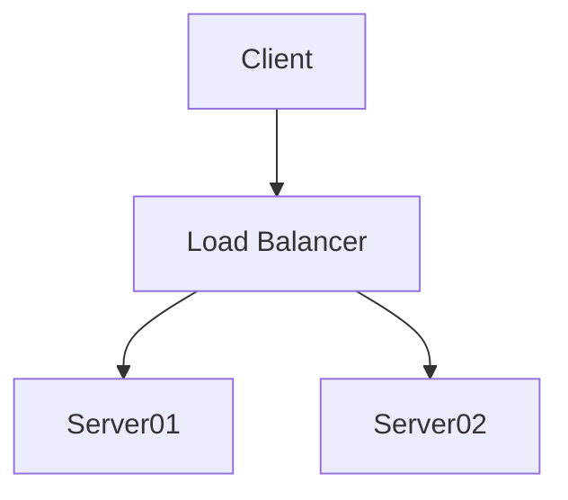
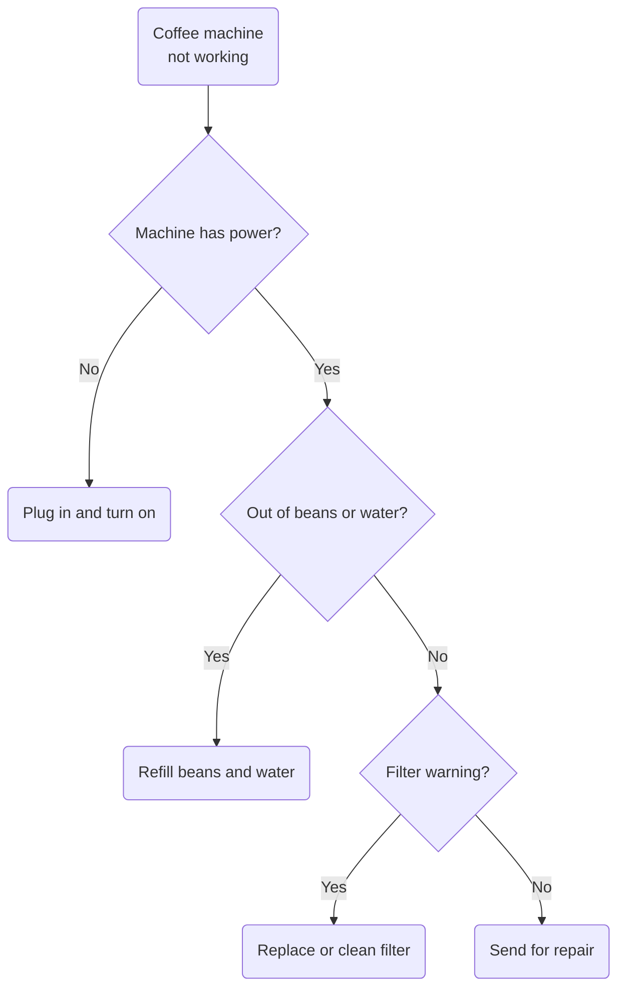
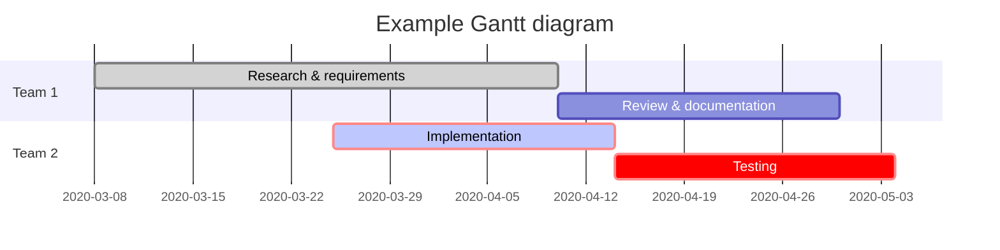
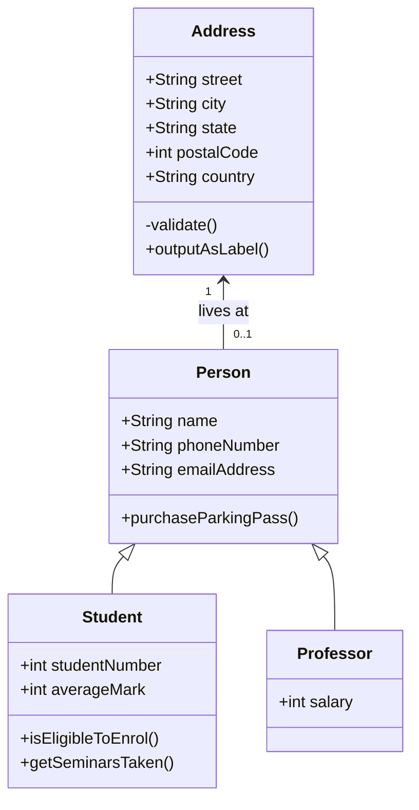

## Online Diagramming Tools

Since I don't have a licence for Visio I tend to use the popular drawing tool [diagrams.net](https://www.diagrams.net/) which is an excellent and highly flexible open source, online, desktop and container-deployable diagramming tool.

???info "More about `diagrams.net`"
    **diagrams.net** used to be called **draw.io**.

    It lets you create a wide range of diagrams, from simple tree and flow diagrams, to highly technical network, rack and electrical diagrams.

    It’s a free, online diagram editor and viewer with a wide variety of shapes, icons, connector and templates to help you get started quickly. It’s also feature-rich–experienced diagrammers will feel at home.

    It aims to provide free, high quality diagramming software for everyone, and disrupt the diagramming industry in the process.

    You can [deploy diagrams.net in a docker container](https://github.com/jgraph/docker-drawio) for secure diagramming in your company behind your firewall.

If you're a user of **diagrams.net** / **draw.io** then have a look at my page on how to [Import Shapes into Draw.io](https://rohancragg.co.uk/misc/shapes/)

## Diagrams-as-Code

[Mermaid.js](https://mermaid-js.github.io/mermaid/#/) is a syntax that allows you to use text to describe and automatically generate diagrams. You can generate flow charts, UML diagrams, pie charts, Gantt charts, and more.

As a developer, I prefer to describe data structures and processes using text wherever I can so that I can more easily use version control systems to track the history of my diagrams.


You can use the [Mermaid Live Editor](https://mermaid-js.github.io/mermaid-live-editor) to learn the syntax.

Amazingly, Mermaid can also be imported into **Diagrams.net**:

> [Use Mermaid syntax to create diagrams in Diagrams.net](https://www.diagrams.net/blog/mermaid-diagrams)

## Diagramming in Markdown

Having learned the Mermaid syntax, I can also used it on my website without exporting diagrams into an image file first, or taking a screenshot!

So that this!

````

````

Becomes this!


As I [mention elsewhere](/misc/scoop/#mkdocs), I use MkDocs to generate this website into HTML from a textual format called MarkDown. An extension for Python Markdown called [SuperFences](https://facelessuser.github.io/pymdown-extensions/extensions/superfences/) allows textual representations of diagrams in formats such as the Mermaid format mentioned above to be rendered directly into the page, simply by adding it to the MarkDown document. SuperFences is part of the [PyMdown Extensions](https://facelessuser.github.io/pymdown-extensions/) project which itself is bundled with [Material for Markdown](https://squidfunk.github.io/mkdocs-material/extensions/pymdown/)

> 

Here are the examples from the Diagrams.net blog post to show that they work in MkDocs too!

### Mermaid Examples

#### Flowchart



#### Gantt Chart



#### UML Class Diagram



--8<--
mermaid.txt
--8<--
